```mermaid
erDiagram

    %% ─── PROJECT ROOT ───────────────────────────────────────────────

    PROJECT {
        string  id PK
        string  name
        string  vision
        string  non_goals
        string  repository_map
        enum    status "not_started|in_progress|complete|on_hold|abandoned"
        enum    stage  "uninitialised|phase_1|phase_2|phase_3|phase_4|complete|abandoned|on_hold"
        enum    mode   "normal|change_management|infeasibility_review|phase_gate|awaiting_specialist"
    }

    PROJECT_COMPLETION_RECORD {
        string  id PK
        string  project_id FK
        datetime completed_at
        string  confirmed_by
        string  goals_assessment
        string  milestones_review
        string  scope_delta
        int     total_active_seconds
        decimal total_estimated_cost
        string  estimate_accuracy_notes
        string  key_decisions
        string  risks_summary
        string  learnings
    }

    PROJECT ||--o| PROJECT_COMPLETION_RECORD : "has"

    %% ─── GOALS ──────────────────────────────────────────────────────

    GOAL {
        string  id PK
        string  project_id FK
        string  statement
        enum    status "not_started|in_progress|achieved|abandoned"
    }

    GOAL_COMPLETION_RECORD {
        string   id PK
        string   goal_id FK
        datetime achieved_at
        string   confirmed_by
        string   goal_statement_at_achievement
        string   evaluation_notes
    }

    GOAL_EPIC_MAP {
        string  goal_id FK
        string  epic_id FK
    }

    PROJECT ||--|{ GOAL : "has"
    GOAL    ||--o| GOAL_COMPLETION_RECORD : "has"

    %% ─── PROJECT RESOURCES ──────────────────────────────────────────

    TECH_STACK_ENTRY {
        string  id PK
        string  project_id FK
        string  name
        enum    category "language|runtime|framework|library|database|service|tool"
        string  version
        string  purpose
        string  documentation_url
        string  project_specific_notes
        enum    verification_status "unverified|verified|stale"
    }

    SHARED_DOC_REF {
        string  id PK
        string  project_id FK
        string  name
        string  url_or_path
        string  description
        string  scope
    }

    RULE {
        string  id PK
        string  project_id FK
        string  statement
        string  rationale
        string  scope
        string  enforcement
    }

    CONVENTION {
        string  id PK
        string  project_id FK
        string  name
        string  description
        string  rationale
        string  applies_to
    }

    PROJECT ||--o{ TECH_STACK_ENTRY : "has"
    PROJECT ||--o{ SHARED_DOC_REF   : "has"
    PROJECT ||--o{ RULE             : "has"
    PROJECT ||--o{ CONVENTION       : "has"

    %% ─── MILESTONES ─────────────────────────────────────────────────

    MILESTONE {
        string   id PK
        string   project_id FK
        string   name
        string   description
        string   exit_criteria
        date     target_date
        enum     status "pending|active|reached|abandoned"
    }

    MILESTONE_REVIEW_RECORD {
        string   id PK
        string   milestone_id FK
        datetime reached_at
        string   confirmed_by
        string   exit_criteria_results
        string   epics_on_time_vs_slipped
        string   scope_delta
        decimal  actual_ai_cost
        string   key_decisions
        string   risks_realized
        string   notes
    }

    PROJECT   ||--|{ MILESTONE              : "has"
    MILESTONE ||--o| MILESTONE_REVIEW_RECORD : "has"

    %% ─── EPICS ──────────────────────────────────────────────────────

    EPIC {
        string  id PK
        string  project_id FK
        string  milestone_id FK
        string  name
        string  description
        string  scope_in
        string  scope_out
        string  acceptance_criteria
        enum    status "pending|active|complete|abandoned"
        boolean is_infrastructure
        string  constraint_or_resource_link
        string  notes_learnings
    }

    EPIC_DEPENDENCY {
        string  id PK
        string  requires_epic_id FK
        string  enables_epic_id FK
        enum    nature "hard|soft"
        string  gate_condition
    }

    EPIC_COMPLETION_RECORD {
        string   id PK
        string   epic_id FK
        datetime completed_at
        string   confirmed_by
        string   acceptance_criteria_results
        string   scope_delta
        int      total_tasks_done
        int      total_tasks_cancelled
        int      total_active_seconds
        decimal  total_estimated_cost
        string   notes_learnings
    }

    PROJECT         ||--|{ EPIC               : "has"
    MILESTONE       ||--o{ EPIC               : "associated"
    GOAL_EPIC_MAP   }o--|| EPIC               : "epic"
    GOAL_EPIC_MAP   }o--|| GOAL               : "goal"
    EPIC            ||--o{ EPIC_DEPENDENCY    : "requires"
    EPIC            ||--o{ EPIC_DEPENDENCY    : "enables"
    EPIC            ||--o| EPIC_COMPLETION_RECORD : "has"

    %% ─── TASKS ──────────────────────────────────────────────────────

    TASK {
        string   id PK
        string   epic_id FK
        string   name
        enum     status "pending|active|blocked|needs_review|in_review|done|cancelled"
        enum     priority "critical|high|medium|low"
        string   estimate
        enum     delegation "implement|plan|research|human|specialist"
        string   goal_statement
        string   context
        date     research_date
        string   acceptance_criteria
        string   affected_files
        string   notes
    }

    SUBTASK {
        string  id PK
        string  task_id FK
        int     order_index
        string  description
        boolean done
        string  notes
    }

    TASK_ATTACHMENT {
        string  id PK
        string  task_id FK
        string  label
        string  url_or_path
        string  type
    }

    EPIC ||--|{ TASK    : "contains"
    TASK ||--o{ SUBTASK : "has"
    TASK ||--o{ TASK_ATTACHMENT : "has"

    %% ─── TASK RESOURCE REFERENCES ───────────────────────────────────

    TASK_RESOURCE_REF {
        string  task_id FK
        string  resource_id
        enum    resource_type "tech_stack|shared_doc|rule|convention"
    }

    TASK ||--o{ TASK_RESOURCE_REF : "references"

    %% ─── BLOCKERS & DEPENDENCIES ────────────────────────────────────

    BLOCKER {
        string  id PK
        string  task_id FK
        string  description
        enum    type "dependency|decision|external|resource|specialist_routing|verification_failure"
        string  resolution_path
        string  blocking_task_id
        boolean resolved
        datetime resolved_at
    }

    TASK_DEPENDENCY {
        string  id PK
        string  task_id FK
        string  requires_task_id FK
        enum    nature "hard|soft"
    }

    TASK ||--o{ BLOCKER         : "has"
    TASK ||--o{ TASK_DEPENDENCY : "has"

    %% ─── PATTERN CONTRACTS ──────────────────────────────────────────

    PATTERN_CONTRACT {
        string  id PK
        string  establishing_task_id FK
        string  name
        int     current_version
        string  definition
        enum    status "draft|established|changed|superseded"
        string  superseded_by_contract_id
    }

    PATTERN_CONTRACT_VERSION {
        string   id PK
        string   contract_id FK
        int      version_number
        string   definition_at_version
        datetime changed_at
        string   change_summary
        string   triggered_reviews_on
    }

    PATTERN_DEPENDENCY {
        string  id PK
        string  task_id FK
        string  contract_id FK
        string  source_task_id
        string  pattern_name
        int     locked_version
        string  expectation
        enum    review_status "current|needs_review|updated"
        string  review_note
    }

    TASK ||--o{ PATTERN_CONTRACT   : "establishes"
    TASK ||--o{ PATTERN_DEPENDENCY : "relies on"
    PATTERN_CONTRACT ||--o{ PATTERN_CONTRACT_VERSION : "history"
    PATTERN_CONTRACT ||--o{ PATTERN_DEPENDENCY       : "depended on by"

    %% ─── VERIFICATIONS ──────────────────────────────────────────────

    VERIFICATION {
        string  id PK
        string  task_id FK
        enum    type "documentation|research|testing|code_review|external_validation"
        string  source
        enum    current_result "passed|failed|partial|pending"
        boolean stale
    }

    VERIFICATION_ATTEMPT {
        string   id PK
        string   verification_id FK
        int      attempt_number
        enum     result "passed|failed|partial"
        string   performed_by
        datetime date
        string   notes
    }

    TASK         ||--o{ VERIFICATION         : "has"
    VERIFICATION ||--|{ VERIFICATION_ATTEMPT : "has"

    %% ─── TRACKING ───────────────────────────────────────────────────

    WORK_INTERVAL {
        string   id PK
        string   task_id FK
        string   session_log_id FK
        datetime started_at
        datetime ended_at
        int      active_duration_seconds
        string   model
        string   provider
        int      tokens_in
        int      tokens_out
        decimal  estimated_cost
        enum     trigger "user_prompt|agent_continuation|command"
    }

    COMPLETION_RECORD {
        string   id PK
        string   task_id FK
        datetime completed_at
        string   completed_by
        string   commit_reference
        int      elapsed_seconds
        int      total_active_seconds
        decimal  total_cost
        string   model_summary
        string   files_touched
        int      lines_added
        int      lines_removed
        int      net_lines
        int      characters_changed
        string   estimate_accuracy
        string   learnings
        string   review_outcome
        string   review_notes
    }

    TASK ||--o{ WORK_INTERVAL   : "has"
    TASK ||--o| COMPLETION_RECORD : "has"

    %% ─── SESSION LOG ─────────────────────────────────────────────────

    SESSION_LOG {
        string   id PK
        string   project_id FK
        int      entry_number
        datetime timestamp
        string   author
        string   active_task_id FK
        boolean  is_phase_completion_record
        string   exact_state
        string   completed_this_session
        string   open_questions
        string   next_actions
        string   relevant_files
        string   git_branch
        string   git_last_commit
        string   git_uncommitted_changes
        string   pending_reviews
    }

    PHASE_COMPLETION_RECORD {
        string   id PK
        string   session_log_id FK
        int      phase_number
        string   phase_name
        datetime completed_at
        string   output_checklist
        string   open_questions
        string   entry_condition_for_next
        enum     gate_status "passed|not_passed"
        string   gate_failures
    }

    PROJECT      ||--|{ SESSION_LOG            : "has"
    SESSION_LOG  ||--o| PHASE_COMPLETION_RECORD : "specialized as"
    SESSION_LOG  ||--o{ WORK_INTERVAL          : "contains"

    %% ─── DECISIONS & QUESTIONS ──────────────────────────────────────

    DECISION {
        string   id PK
        string   project_id FK
        string   title
        date     date
        string   context
        string   decision
        string   rationale
        string   consequences
        string   affected_task_ids
        enum     status "active|superseded|revisited"
        string   superseded_by_id FK
    }

    QUESTION {
        string  id PK
        string  project_id FK
        string  description
        string  impact_entity_ids
        string  options
        string  owner
        enum    status "open|resolved|deferred|dropped"
        string  resolution
        string  resulting_decision_id FK
        int     session_count
        boolean escalation_flag
        string  defer_until_condition
    }

    PROJECT ||--o{ DECISION : "has"
    PROJECT ||--o{ QUESTION : "has"

    %% ─── RISKS ──────────────────────────────────────────────────────

    RISK {
        string  id PK
        string  project_id FK
        string  description
        enum    likelihood "high|medium|low"
        string  impact
        string  affected_entity_ids
        string  mitigation
        string  mitigation_task_id FK
        enum    status "open|mitigated|realized|accepted"
        string  owner
        string  identified_at_phase
        date    last_reviewed
        string  realization_notes
    }

    PROJECT ||--o{ RISK : "risk register"

    %% ─── CHANGE MANAGEMENT ──────────────────────────────────────────

    CHANGE_REQUEST {
        string   id PK
        string   project_id FK
        string   initiator
        string   target_entity_type
        string   target_entity_id
        string   previous_state
        string   proposed_state
        string   rationale
        string   impact_analysis
        string   required_phase_reruns
        enum     status "pending_review|approved|rejected"
        string   human_sign_off
        string   rejection_rationale
        string   resulting_scope_change_id FK
    }

    SCOPE_CHANGE {
        string   id PK
        string   change_request_id FK
        string   project_id FK
        string   target_entity_type
        string   target_entity_id
        string   previous_state
        string   new_state
        string   rationale
        string   triggered_by_type
        string   triggered_by_id
        string   downstream_impact
        string   required_actions_checklist
        string   human_sign_off
        enum     status "pending|applied"
    }

    ABANDONMENT_RECORD {
        string   id PK
        string   project_id FK
        string   entity_type
        string   entity_id
        datetime abandoned_at
        string   rationale
        string   state_at_abandonment
        enum     disposition "retained|discarded|archived"
        string   impact_on_goals
        string   human_sign_off
    }

    PROJECT ||--o{ CHANGE_REQUEST    : "has"
    PROJECT ||--o{ SCOPE_CHANGE      : "has"
    PROJECT ||--o{ ABANDONMENT_RECORD : "has"
    CHANGE_REQUEST ||--o| SCOPE_CHANGE : "produces"
```

# Entity-Relationship Diagram

Database structure for the AI-Optimized Project Management Framework. All entities, fields, and relationships are derived directly from the framework definitions.

---

---

## Key Cardinality Summary

| Relationship | Cardinality | Notes |
|---|---|---|
| Project → Goals | 1 to many | Each Goal belongs to exactly one Project |
| Project → Epics | 1 to many | Each Epic belongs to exactly one Project |
| Goal ↔ Epic | many to many | Via GOAL_EPIC_MAP join table |
| Milestone → Epics | 1 to many | Each Epic belongs to one Milestone |
| Epic → Tasks | 1 to many | Each Task belongs to exactly one Epic |
| Task → Pattern Contracts | 1 to many | A Task may establish multiple contracts |
| Pattern Contract → Pattern Dependencies | 1 to many | Multiple Tasks may depend on one contract |
| Task → Verifications | 1 to many | Multiple verification types per task |
| Verification → Attempts | 1 to many | Full attempt history; current result = latest |
| Session Log → Phase Completion Records | 1 to 0-or-1 | A session log entry is either ordinary or a PCR |
| Change Request → Scope Change | 1 to 0-or-1 | Only approved CRs produce a Scope Change |
| Risk → Blocker | conceptual | Realized risks generate Blockers on affected Tasks |
| Question → Blocker | conceptual | Open Questions auto-generate Blockers when Tasks go Active |
