# Framework Flowcharts

All major processes and workflows in diagram form. Start with the Stage + Mode tracker (the global position indicator), then the high-level lifecycle, then dedicated charts for each workflow area.

---

## 0 — Project Stage & Mode: Global State Tracker

**Stage** = which phase of the lifecycle the project is in.
**Mode** = what is operationally happening within that phase right now.

These two fields on the Project entity are the first thing any agent reads on cold-start. Together they determine what kind of work is permitted and where to look next.

### Stage Transitions

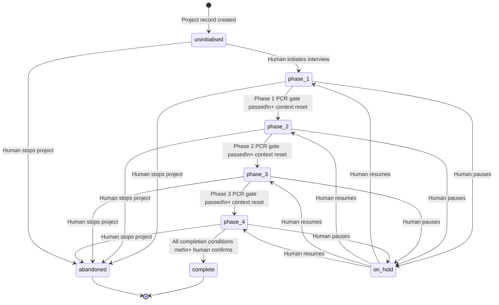

### Mode Transitions (overlays any Stage)

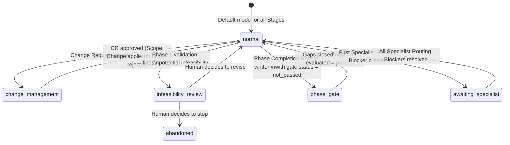

### Cold-Start Decision Table

What an agent does immediately after reading Stage + Mode:

| Stage | Mode | Agent's first action |
|---|---|---|
| `uninitialised` | `normal` | Begin Phase 1 interview |
| `phase_1` | `normal` | Continue interview — read last Session Log entry for Exact State |
| `phase_1` | `infeasibility_review` | Read Infeasibility Finding — await human decision |
| `phase_2` | `normal` | Continue planning — read last Session Log entry |
| `phase_2` | `phase_gate` | Read Phase 2 PCR — identify failed checklist items — return to planning |
| `phase_3` | `normal` | Continue decomposition — read last Session Log entry |
| `phase_3` | `phase_gate` | Read Phase 3 PCR — identify failed checklist items — return to decomposition |
| `phase_4` | `normal` | Read Session Log → Active Task → resume implementation loop |
| `phase_4` | `change_management` | Read open Change Request — do not start new tasks — assist with impact analysis |
| `phase_4` | `awaiting_specialist` | Read Blocked tasks — surface routing status to human — work non-Specialist tasks if available |
| `phase_4` | `phase_gate` | Read Phase 3 PCR for gate failures — surface to human (should not normally occur in Phase 4) |
| `any` | `normal` | `on_hold` Stage: read Session Log for hold reason — surface to human to decide whether to resume |
| `complete` | `normal` | Read Project Completion Record — project is done |
| `abandoned` | `normal` | Read Abandonment Record — project is stopped |

---

## 1 — High-Level Project Lifecycle

```mermaid
flowchart TD
    START([Project Initiated]) --> P1

    subgraph P1["Phase 1 · Project Interview"]
        P1A[Human describes project] --> P1B[Iterative interview\none question at a time]
        P1B --> P1C{Existing\ncodebase?}
        P1C -- Yes --> P1D[Onboarding variant:\nIngest code · surface decisions\nreverse-engineer contracts · log risks]
        P1C -- No --> P1E[Standard flow]
        P1D --> P1E
        P1E --> P1F[Validation pass:\nconflicts · gaps · feasibility]
        P1F --> P1G{Project\nfeasible?}
        P1G -- No --> P1H[Infeasibility Finding\nproduced]
        P1H --> P1I{Human\ndecision}
        P1I -- Revise --> P1B
        P1I -- Stop --> ABANDONED([Project Abandoned])
        P1G -- Yes --> P1J[Entities written in real time:\nProject · Goals · Resources\nDecisions · Questions · Risks]
    end

    P1J --> PCR1{Phase 1\nCompletion Record\ngate passed?}
    PCR1 -- No --> P1J
    PCR1 -- Yes --> RESET1[Context Reset]
    RESET1 --> P2

    subgraph P2["Phase 2 · Epic & Milestone Planning"]
        P2A[Read Phase 1 output] --> P2B[Propose Epics\nincl. Infrastructure Epics]
        P2B --> P2C[Human reviews\nadjusts scope-in · scope-out]
        P2C --> P2D[Define Epic Dependencies\nhard · soft · gate conditions]
        P2D --> P2E[Define Milestones\nwith Exit Criteria]
        P2E --> P2F[Map Goals → Epics\ncheck every Goal covered]
        P2F --> P2G[Update Risk Register]
    end

    P2G --> PCR2{Phase 2\nCompletion Record\ngate passed?}
    PCR2 -- No --> P2F
    PCR2 -- Yes --> RESET2[Context Reset]
    RESET2 --> P3

    subgraph P3["Phase 3 · Task Research & Decomposition"]
        P3A[Read Phase 2 output] --> P3B[One Epic at a time\nper planned order]
        P3B --> P3C[Propose task list\nHuman reviews]
        P3C --> P3D[Research each task\nwrite Context + Research Date]
        P3D --> P3E[Define Pattern Contracts\nsubtasks · acceptance criteria\npre-populate Verifications]
        P3E --> P3F[Map Dependencies\nTask + Epic level]
        P3F --> P3G[Log Risks from research]
        P3G --> P3H{More Epics?}
        P3H -- Yes --> P3B
        P3H -- No --> P3I[Resolve or record\nall open Questions]
    end

    P3I --> PCR3{Phase 3\nCompletion Record\ngate passed?}
    PCR3 -- No --> P3I
    PCR3 -- Yes --> RESET3[Context Reset]
    RESET3 --> P4

    subgraph P4["Phase 4 · Implementation"]
        P4A[Bootstrap sequence\nsee Flow 5] --> P4B[Implementation Loop\nsee Flow 5]
        P4B --> P4C{All tasks\nDone?}
        P4C -- No --> P4B
        P4C -- Yes --> P4D[Epic Completion checks]
        P4D --> P4E[Milestone Completion checks]
        P4E --> P4F[Goal Completion checks]
        P4F --> P4G{Project\ncompletion\ncondition met?}
        P4G -- No --> P4B
        P4G -- Yes --> P4H[Human confirms\nProject Completion]
    end

    P4H --> COMPLETE([Project Complete\nProject Completion Record written])
```

---

## 2 — Phase 1: Interview Detail

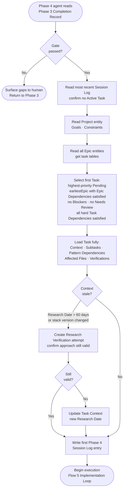

---

## 3 — Phase 2: Planning Detail

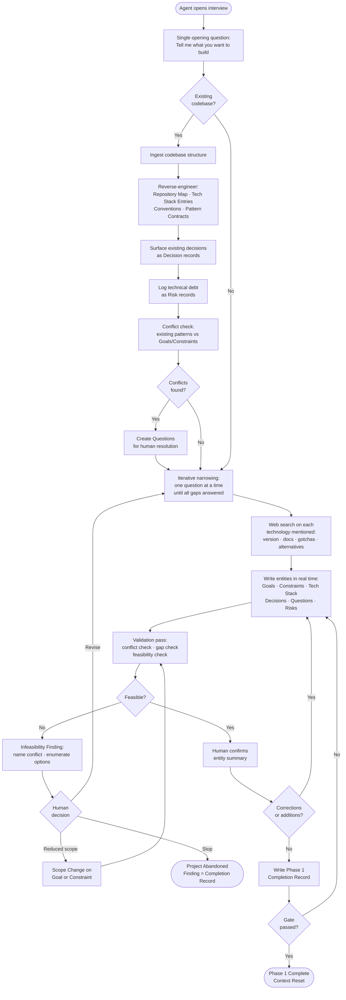

---

## 4 — Phase 3: Decomposition Detail

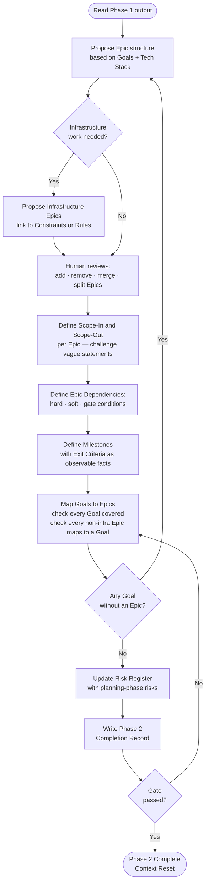

---

## 5 — Phase 4: Bootstrap + Implementation Loop

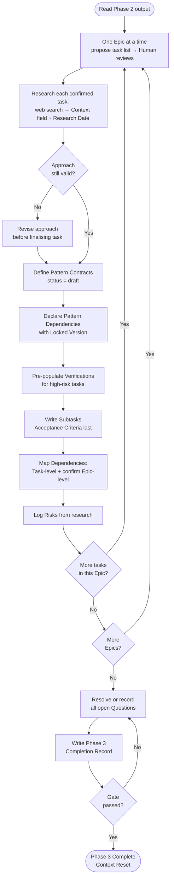

---

## 6 — Task Execution Detail

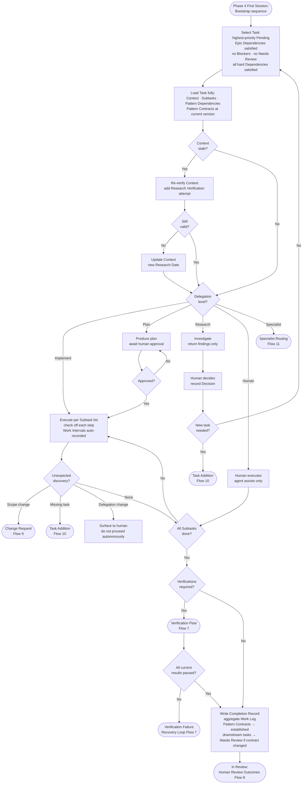

---

## 7 — Verification Failure Recovery Loop

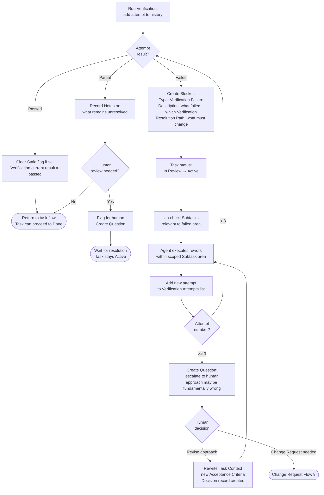

---

## 8 — Human Review Outcomes

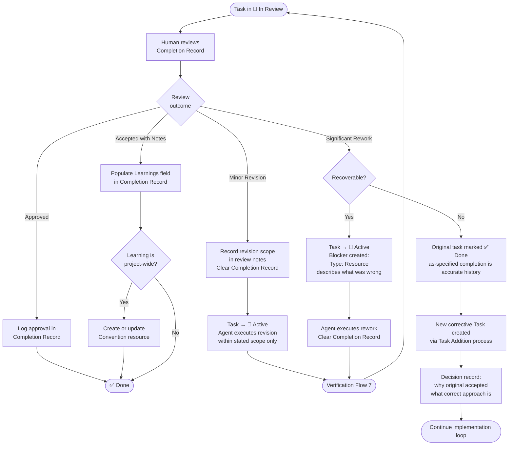

---

## 9 — Change Management Flow

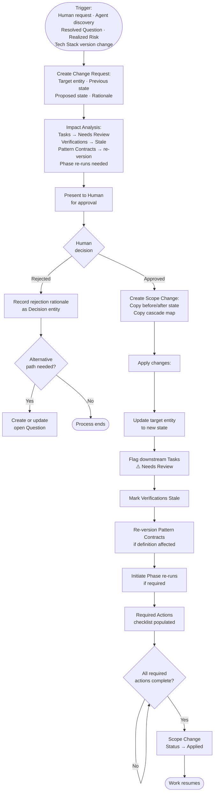

---

## 10 — Task Addition Process (Unplanned Discovery)

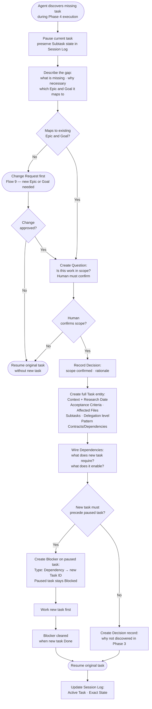

---

## 11 — Specialist Routing Process

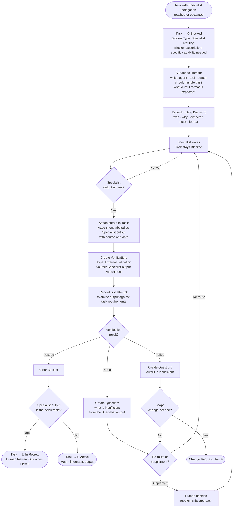

---

## 12 — Epic Completion Flow

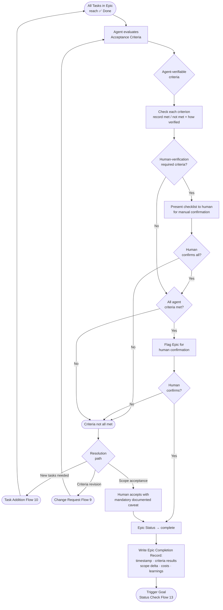

---

## 13 — Milestone Completion Flow

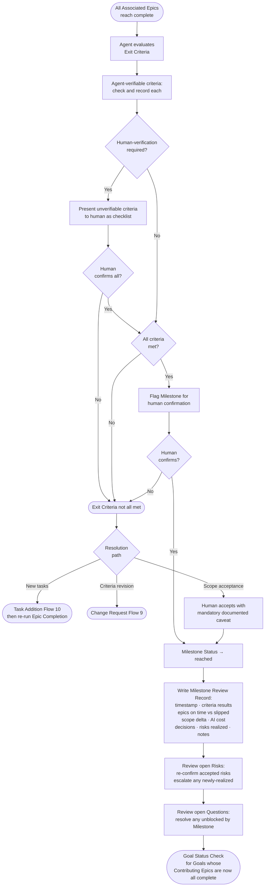

---

## 14 — Goal Status Check

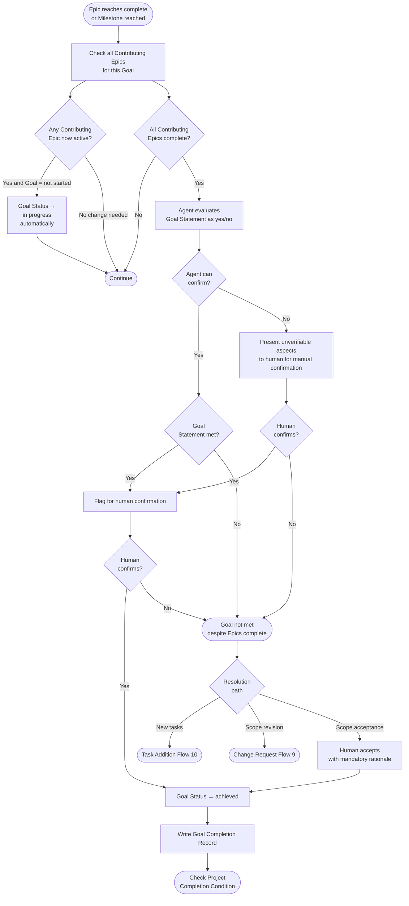

---

## 15 — Needs Review Resolution

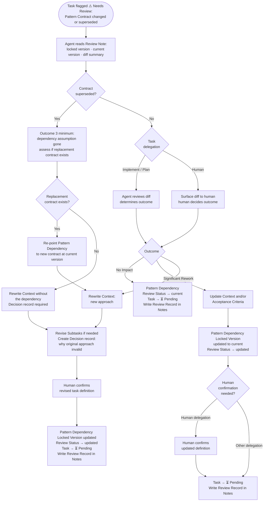

---

## 16 — Question Aging & Escalation

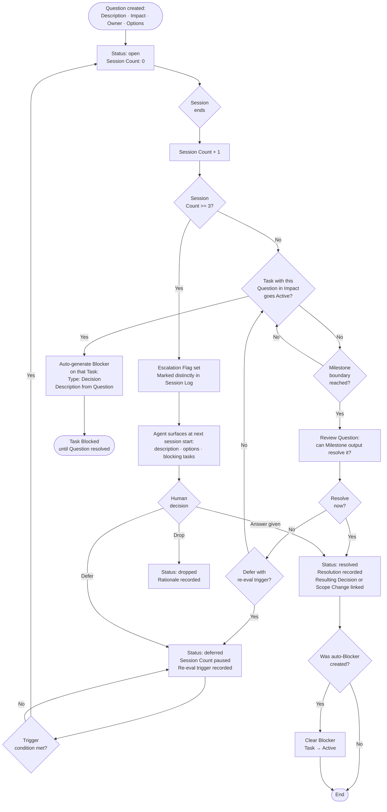

---

## 17 — Risk Lifecycle

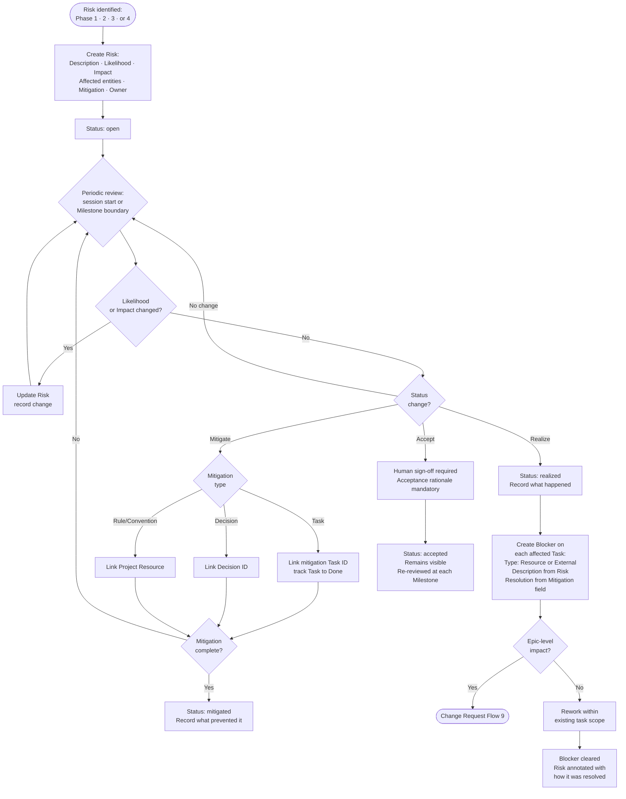

---

## 18 — Phase Completion Record Gate

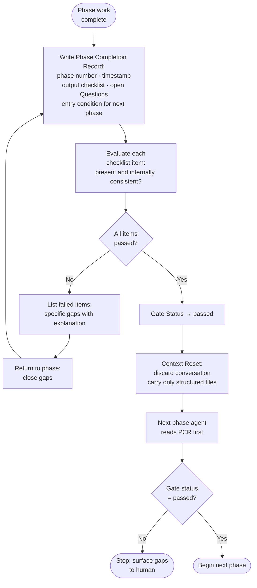
