# Framework Flowcharts

All major processes and workflows in diagram form. Start with the Stage + Mode tracker (the global position indicator), then the high-level lifecycle, then dedicated charts for each workflow area.

---

## 0 — Project Stage & Mode: Global State Tracker

**Stage** = which phase of the lifecycle the project is in.
**Mode** = what is operationally happening within that phase right now.

These two fields on the Project entity are the first thing any agent reads on cold-start. Together they determine what kind of work is permitted and where to look next.

### Stage Transitions

### Mode Transitions (overlays any Stage)

### Cold-Start Decision Table

What an agent does immediately after reading Stage + Mode:

| Stage | Mode | Agent's first action |
|---|---|---|
| `uninitialised` | `normal` | Begin Phase 1 interview |
| `phase_1` | `normal` | Continue interview — read last Session Log entry for Exact State |
| `phase_1` | `infeasibility_review` | Read Infeasibility Finding — await human decision |
| `phase_2` | `normal` | Continue planning — read last Session Log entry |
| `phase_2` | `phase_gate` | Read Phase 2 PCR — identify failed checklist items — return to planning |
| `phase_3` | `normal` | Continue decomposition — read last Session Log entry |
| `phase_3` | `phase_gate` | Read Phase 3 PCR — identify failed checklist items — return to decomposition |
| `phase_4` | `normal` | Read Session Log → Active Task → resume implementation loop |
| `phase_4` | `change_management` | Read open Change Request — do not start new tasks — assist with impact analysis |
| `phase_4` | `awaiting_specialist` | Read Blocked tasks — surface routing status to human — work non-Specialist tasks if available |
| `phase_4` | `phase_gate` | Read Phase 3 PCR for gate failures — surface to human (should not normally occur in Phase 4) |
| `any` | `normal` | `on_hold` Stage: read Session Log for hold reason — surface to human to decide whether to resume |
| `complete` | `normal` | Read Project Completion Record — project is done |
| `abandoned` | `normal` | Read Abandonment Record — project is stopped |

---

## 1 — High-Level Project Lifecycle

---

## 2 — Phase 1: Interview Detail

```mermaid
flowchart TD
    ENTRY([Phase 4 agent reads\nPhase 3 Completion Record]) --> GATE{Gate\npassed?}
    GATE -- No --> STOP1([Surface gaps to human\nReturn to Phase 3])
    GATE -- Yes --> CHK[Read most recent Session Log\nconfirm no Active Task]
    CHK --> READ[Read Project entity\nGoals · Constraints]
    READ --> EPICS[Read all Epic entities\nget task tables]
    EPICS --> SELECT[Select first Task:\nhighest-priority Pending\nearliestEpic with Epic Dependencies satisfied\nno Blockers · no Needs Review\nall hard Task Dependencies satisfied]
    SELECT --> LOAD[Load Task fully:\nContext · Subtasks · Pattern Dependencies\nAffected Files · Verifications]
    LOAD --> STALE{Context\nstale?}
    STALE -- "Research Date > 60 days\nor stack version changed" --> REVERIFY[Create Research Verification attempt\nconfirm approach still valid]
    REVERIFY --> VALID{Still\nvalid?}
    VALID -- No --> UPDATE[Update Task Context\nnew Research Date]
    VALID -- Yes --> LOG
    UPDATE --> LOG
    STALE -- No --> LOG
    LOG[Write first Phase 4\nSession Log entry] --> BEGIN([Begin execution\nFlow 5 Implementation Loop])
```

---

## 3 — Phase 2: Planning Detail

```mermaid
flowchart TD
    ENTRY([Agent opens interview]) --> OPEN["Single opening question:\nTell me what you want to build"]
    OPEN --> EXISTING{Existing\ncodebase?}

    EXISTING -- Yes --> OB1[Ingest codebase structure]
    OB1 --> OB2[Reverse-engineer:\nRepository Map · Tech Stack Entries\nConventions · Pattern Contracts]
    OB2 --> OB3[Surface existing decisions\nas Decision records]
    OB3 --> OB4[Log technical debt\nas Risk records]
    OB4 --> OB5[Conflict check:\nexisting patterns vs Goals/Constraints]
    OB5 --> OB6{Conflicts\nfound?}
    OB6 -- Yes --> OB7[Create Questions\nfor human resolution]
    OB7 --> NARROW
    OB6 -- No --> NARROW

    EXISTING -- No --> NARROW

    NARROW[Iterative narrowing:\none question at a time\nuntil all gaps answered] --> WEB[Web search on each\ntechnology mentioned:\nversion · docs · gotchas · alternatives]
    WEB --> WRITE[Write entities in real time:\nGoals · Constraints · Tech Stack\nDecisions · Questions · Risks]
    WRITE --> VAL[Validation pass:\nconflict check · gap check\nfeasibility check]

    VAL --> FEASIBLE{Feasible?}
    FEASIBLE -- No --> INFEAS[Infeasibility Finding:\nname conflict · enumerate options]
    INFEAS --> HDEC{Human\ndecision}
    HDEC -- Revise --> NARROW
    HDEC -- Reduced scope --> SC[Scope Change on\nGoal or Constraint]
    SC --> VAL
    HDEC -- Stop --> ABANDON([Project Abandoned\nFinding = Completion Record])

    FEASIBLE -- Yes --> CONFIRM[Human confirms\nentity summary]
    CONFIRM --> MORE{Corrections\nor additions?}
    MORE -- Yes --> WRITE
    MORE -- No --> PCR[Write Phase 1\nCompletion Record]
    PCR --> GATE{Gate\npassed?}
    GATE -- No --> WRITE
    GATE -- Yes --> DONE([Phase 1 Complete\nContext Reset])
```

---

## 4 — Phase 3: Decomposition Detail

---

## 5 — Phase 4: Bootstrap + Implementation Loop

```mermaid
flowchart TD
    ENTRY([Read Phase 2 output]) --> TASK[One Epic at a time\npropose task list → Human reviews]
    TASK --> RESEARCH[Research each confirmed task:\nweb search → Context field + Research Date]
    RESEARCH --> STALE{Approach\nstill valid?}
    STALE -- No --> UPDATE[Revise approach\nbefore finalising task]
    UPDATE --> PC
    STALE -- Yes --> PC
    PC[Define Pattern Contracts\nstatus = draft] --> PD[Declare Pattern Dependencies\nwith Locked Version]
    PD --> VER[Pre-populate Verifications\nfor high-risk tasks]
    VER --> SUB[Write Subtasks\nAcceptance Criteria last]
    SUB --> DEPDEP[Map Dependencies:\nTask-level + confirm Epic-level]
    DEPDEP --> RISKLOG[Log Risks from research]
    RISKLOG --> MORE{More tasks\nin this Epic?}
    MORE -- Yes --> TASK
    MORE -- No --> MOREEPIC{More\nEpics?}
    MOREEPIC -- Yes --> TASK
    MOREEPIC -- No --> QRESOLVE[Resolve or record\nall open Questions]
    QRESOLVE --> PCR[Write Phase 3\nCompletion Record]
    PCR --> GATE{Gate\npassed?}
    GATE -- No --> QRESOLVE
    GATE -- Yes --> DONE([Phase 3 Complete\nContext Reset])
```

---

## 6 — Task Execution Detail

---

## 7 — Verification Failure Recovery Loop

---

## 8 — Human Review Outcomes

---

## 9 — Change Management Flow

```mermaid
flowchart TD
    TRIGGER([Trigger:\nHuman request · Agent discovery\nResolved Question · Realized Risk\nTech Stack version change]) --> CREATE[Create Change Request:\nTarget entity · Previous state\nProposed state · Rationale]

    CREATE --> IMPACT[Impact Analysis:\nTasks → Needs Review\nVerifications → Stale\nPattern Contracts → re-version\nPhase re-runs needed]

    IMPACT --> HUMANREV[Present to Human\nfor approval]

    HUMANREV --> DECISION{Human\ndecision}

    DECISION -- Rejected --> REJREC[Record rejection rationale\nas Decision entity]
    REJREC --> ALTPATH{Alternative\npath needed?}
    ALTPATH -- Yes --> QUESTION[Create or update\nopen Question]
    ALTPATH -- No --> END([Process ends])

    DECISION -- Approved --> SC[Create Scope Change:\nCopy before/after state\nCopy cascade map]

    SC --> APPLY[Apply changes:]
    APPLY --> A1[Update target entity\nto new state]
    A1 --> A2[Flag downstream Tasks\n⚠️ Needs Review]
    A2 --> A3[Mark Verifications Stale]
    A3 --> A4[Re-version Pattern Contracts\nif definition affected]
    A4 --> A5[Initiate Phase re-runs\nif required]
    A5 --> CHECKLIST[Required Actions\nchecklist populated]

    CHECKLIST --> ACTIONS{All required\nactions complete?}
    ACTIONS -- No --> ACTIONS
    ACTIONS -- Yes --> STATUS[Scope Change\nStatus → Applied]
    STATUS --> RESUME([Work resumes])
```

---

## 10 — Task Addition Process (Unplanned Discovery)

---

## 11 — Specialist Routing Process

---

## 12 — Epic Completion Flow

---

## 13 — Milestone Completion Flow

---

## 14 — Goal Status Check

```mermaid
flowchart TD
    TRIGGER([Epic reaches complete\nor Milestone reached]) --> CHECK[Check all Contributing Epics\nfor this Goal]

    CHECK --> FIRST{Any Contributing\nEpic now active?}
    FIRST -- "Yes and Goal = not started" --> PROGRESS[Goal Status →\nin progress\nautomatically]
    PROGRESS --> CONTINUE([Continue])

    FIRST -- No change needed --> CONTINUE

    CHECK --> ALL{All Contributing\nEpics complete?}
    ALL -- No --> CONTINUE

    ALL -- Yes --> EVAL[Agent evaluates\nGoal Statement as yes/no]
    EVAL --> CANEVAL{Agent can\nconfirm?}

    CANEVAL -- Yes --> GOALMET{Goal\nStatement met?}
    GOALMET -- Yes --> FLAG[Flag for human confirmation]
    FLAG --> HCONFIRM{Human\nconfirms?}
    HCONFIRM -- Yes --> ACHIEVED[Goal Status → achieved]
    ACHIEVED --> GCR[Write Goal Completion Record]
    GCR --> PROJCHECK([Check Project\nCompletion Condition])
    HCONFIRM -- No --> GAP

    GOALMET -- No --> GAP([Goal not met\ndespite Epics complete])
    GAP --> GPATH{Resolution\npath}
    GPATH -- New tasks --> TADD([Task Addition Flow 10])
    GPATH -- Scope revision --> CR([Change Request Flow 9])
    GPATH -- Scope acceptance --> ACCEPT[Human accepts\nwith mandatory rationale]
    ACCEPT --> ACHIEVED

    CANEVAL -- No --> HEVAL[Present unverifiable aspects\nto human for manual confirmation]
    HEVAL --> HRESULT{Human\nconfirms?}
    HRESULT -- Yes --> FLAG
    HRESULT -- No --> GAP
```

---

## 15 — Needs Review Resolution

---

## 16 — Question Aging & Escalation

```mermaid
flowchart TD
    CREATE([Question created:\nDescription · Impact · Owner · Options]) --> OPEN[Status: open\nSession Count: 0]

    OPEN --> SESSEND{Session\nends}
    SESSEND --> INC[Session Count + 1]
    INC --> THRESHOLD{Session\nCount >= 3?}
    THRESHOLD -- Yes --> ESCALATE[Escalation Flag set\nMarked distinctly in Session Log]
    ESCALATE --> SURFACE[Agent surfaces at next session start:\ndescription · options · blocking tasks]
    THRESHOLD -- No --> CHECK

    CHECK{Task with this\nQuestion in Impact\ngoes Active?} -- Yes --> AUTOBLOCKER[Auto-generate Blocker\non that Task:\nType: Decision\nDescription from Question]
    AUTOBLOCKER --> WAIT([Task Blocked\nuntil Question resolved])

    CHECK -- No --> MILESTONE{Milestone\nboundary\nreached?}
    MILESTONE -- Yes --> MSREVIEW[Review Question:\ncan Milestone output resolve it?]
    MSREVIEW --> RESOLVE{Resolve\nnow?}
    RESOLVE -- Yes --> RESOLVED
    RESOLVE -- No --> DEFER{Defer with\nre-eval trigger?}
    DEFER -- Yes --> DEFERRED[Status: deferred\nSession Count paused\nRe-eval trigger recorded]
    DEFERRED --> RETRIG{Trigger\ncondition met?}
    RETRIG -- Yes --> OPEN
    RETRIG -- No --> DEFERRED
    DEFER -- No --> CHECK

    MILESTONE -- No --> CHECK

    SURFACE --> HDEC{Human\ndecision}
    HDEC -- Answer given --> RESOLVED[Status: resolved\nResolution recorded\nResulting Decision or Scope Change linked]
    HDEC -- Defer --> DEFERRED
    HDEC -- Drop --> DROPPED[Status: dropped\nRationale recorded]

    RESOLVED --> UNBLOCK{Was auto-Blocker\ncreated?}
    UNBLOCK -- Yes --> CLEARB[Clear Blocker\nTask → Active]
    UNBLOCK -- No --> END([End])
    CLEARB --> END
```

---

## 17 — Risk Lifecycle

```mermaid
flowchart TD
    IDENTIFY([Risk identified:\nPhase 1 · 2 · 3 · or 4]) --> CREATE[Create Risk:\nDescription · Likelihood · Impact\nAffected entities · Mitigation · Owner]

    CREATE --> OPEN[Status: open]

    OPEN --> REVIEW{Periodic review:\nsession start or\nMilestone boundary}

    REVIEW --> CHANGE{Likelihood\nor Impact changed?}
    CHANGE -- Yes --> UPDATE[Update Risk\nrecord change]
    UPDATE --> REVIEW

    CHANGE -- No --> STATUS{Status\nchange?}

    STATUS -- Mitigate --> MITIGATE{Mitigation\ntype}
    MITIGATE -- Task --> MTASK[Link mitigation Task ID\ntrack Task to Done]
    MITIGATE -- Decision --> MDEC[Link Decision ID]
    MITIGATE -- Rule/Convention --> MRULE[Link Project Resource]
    MTASK --> MCHECK{Mitigation\ncomplete?}
    MDEC --> MCHECK
    MRULE --> MCHECK
    MCHECK -- No --> REVIEW
    MCHECK -- Yes --> MITIGATED[Status: mitigated\nRecord what prevented it]

    STATUS -- Realize --> REALIZED[Status: realized\nRecord what happened]
    REALIZED --> BLOCKER[Create Blocker on\neach affected Task:\nType: Resource or External\nDescription from Risk\nResolution from Mitigation field]
    BLOCKER --> CR{Epic-level\nimpact?}
    CR -- Yes --> CHANGE_REQ([Change Request Flow 9])
    CR -- No --> RWORK[Rework within\nexisting task scope]
    RWORK --> RESOLVED[Blocker cleared\nRisk annotated with\nhow it was resolved]

    STATUS -- Accept --> ACCEPT[Human sign-off required\nAcceptance rationale mandatory]
    ACCEPT --> ACCEPTED[Status: accepted\nRemains visible\nRe-reviewed at each Milestone]

    STATUS -- No change --> REVIEW
```

---

## 18 — Phase Completion Record Gate

```mermaid
flowchart TD
    PHASEEND([Phase work\ncomplete]) --> WRITE[Write Phase Completion Record:\nphase number · timestamp\noutput checklist · open Questions\nentry condition for next phase]

    WRITE --> CHECK[Evaluate each\nchecklist item:\npresent and internally consistent?]

    CHECK --> ALL{All items\npassed?}

    ALL -- No --> GAPS[List failed items:\nspecific gaps with explanation]
    GAPS --> RETURN[Return to phase:\nclose gaps]
    RETURN --> WRITE

    ALL -- Yes --> GATE[Gate Status → passed]
    GATE --> RESET[Context Reset:\ndiscard conversation\ncarry only structured files]
    RESET --> NEXT[Next phase agent\nreads PCR first]
    NEXT --> CONFIRM{Gate status\n= passed?}
    CONFIRM -- No --> STOP([Stop: surface gaps\nto human])
    CONFIRM -- Yes --> BEGIN([Begin next phase])
```

